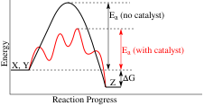

Class Notes:
- [Notes on density functional theory](Notes%20on%20density%20functional%20theory.md)
- [notes on electrochemical engineering](notes%20on%20electrochemical%20engineering.md)

my research lies at the intersection of electrochemistry and catalysis. A catalyst increases the rate of reaction by lowering the activation barrier of a reaction by breaking it down into elementary steps which their own activation barriers as shown below. 

![[simulation.gif]]